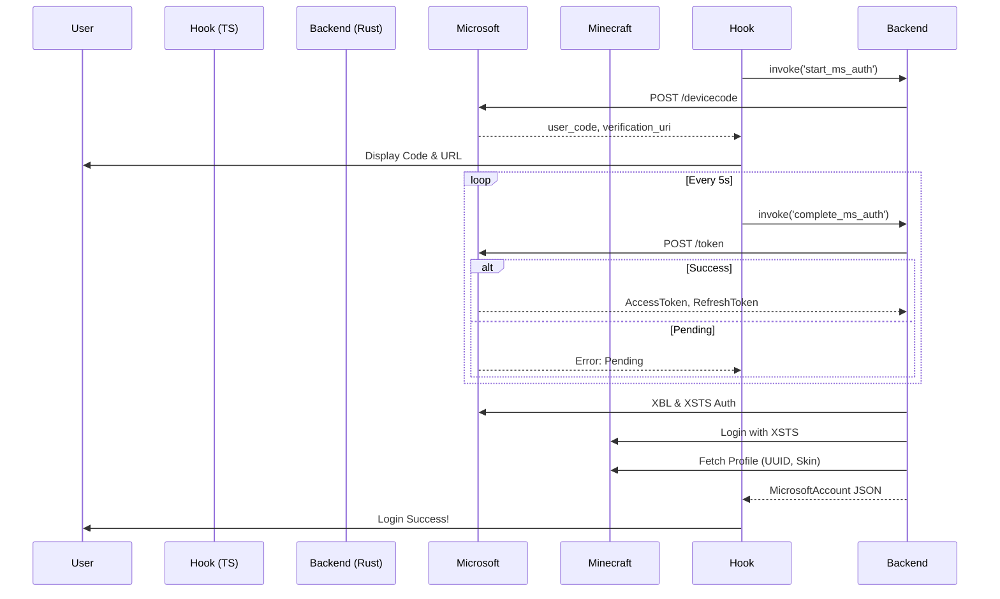

# Microsoft Authentication (Device Code Flow) Documentation

## Overview
JugeLauncher uses the official **Microsoft OAuth2 Device Code Flow**. This allows for a secure, browser-less sign-in experience where the user verifies their identity on a secondary device or browser tab using a unique code.

## Flow Diagram


## Integration Guide
The system is encapsulated in the `useMicrosoftLogin` hook.

### Basic Usage:
```typescript
import { useMicrosoftLogin } from '@/hooks/useMicrosoftLogin';

const MyComponent = () => {
    const { login, status, deviceCode, account } = useMicrosoftLogin();

    return (
        <button onClick={login}>
            {status === 'idle' ? 'Login with Microsoft' : 'Authenticating...'}
        </button>
    );
};
```

## Data Structure
The backend returns a strictly typed `MicrosoftAccount` object:
```json
{
  "uuid": "...",
  "username": "...",
  "accessToken": "...",
  "mcAccessToken": "...",
  "xboxToken": "...",
  "refreshToken": "...",
  "expiresAt": 1707768000
}
```

## Error Handling
The system handles the following states:
- **Pending**: User has not yet entered the code. Handled by the polling hook.
- **Expired**: User took too long to enter the code.
- **Denied**: User cancelled the request on the Microsoft page.
- **Network/Protocol**: Generic connectivity or API errors.
